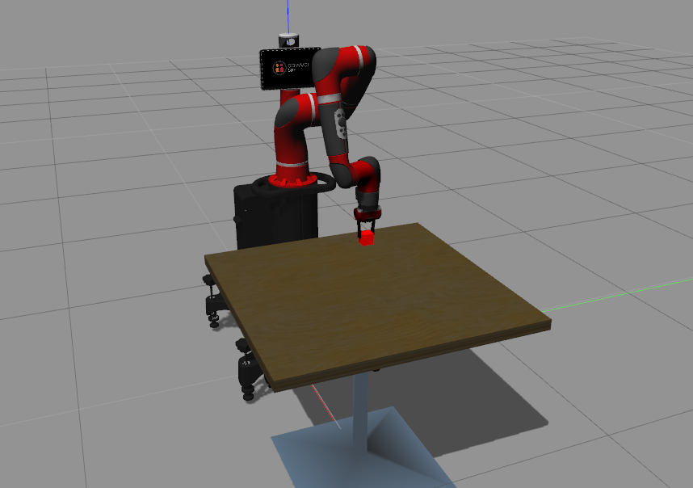

# sawyer-robot-learning
Simulation source code and examples for applying machine learning algorithms on <a href="https://github.com/RethinkRobotics/sawyer_simulator">Sawyer Robot</a>
## Dependencies & Packages:
- <a href="http://releases.ubuntu.com/16.04/">Ubuntu 16.04</a>
- <a href="http://wiki.ros.org/kinetic">ROS Kinetic</a> 
- <a href="http://gazebosim.org/">Gazebo 7</a>
- <a href="https://github.com/RethinkRobotics">Sawyer-ROS Packages & SDK</a>
- Python 3.6

  

