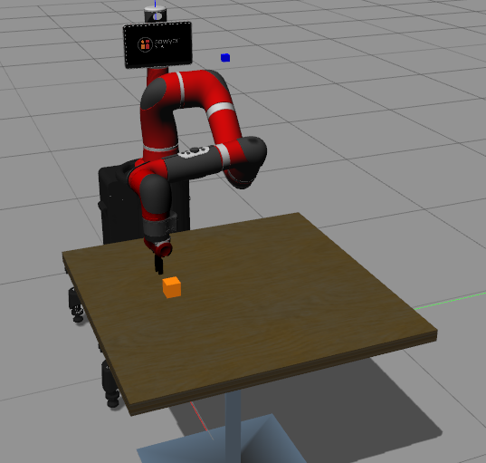

# sawyer-robot-learning
This repository contains the simulation source codes and examples for applying machine learning algorithms on <b><a href="https://github.com/RethinkRobotics/sawyer_simulator">Sawyer Robot</a></b> in Gazebo simulation environment.
## Dependencies & Packages:
- <a href="http://releases.ubuntu.com/16.04/">Ubuntu 16.04</a>
- <a href="http://wiki.ros.org/kinetic">ROS Kinetic</a> 
- <a href="http://gazebosim.org/">Gazebo 7</a>
- <a href="https://github.com/RethinkRobotics">Sawyer-ROS Packages & SDK</a> includes Sawyer robot model & simulator packages for      accessing the Sawyer robot in Gazebo environment.
- Python 3.6

<p align= "center">
  
</p>

## Setting up the package:
Clone the repository into the <b>sawyer file</b>(with the previously installed sawyer simulator and sdk's) and then cd to <b>catkin_ws directory</b>  
```
$ cd catkin_ws
$ catkin_make
```
## How to access the files in the package:
### Terminal 1: To launch the Sawyer robot in Gazebo environment
```
$ roslaunch sawyer_gazebo_env sawyer_gazebo_env.launch
```
### Terminal 2: To launch the task specific environment (eg, reaching task)
```
$ roslaunch sawyer_demonstration sawyer_demonstration.launch \task:=reaching controller:=falcon
```
<b>Note:</b> For different task environment(say, peg in hole) set task:= peginhole and a different controller set controller:=joystick
